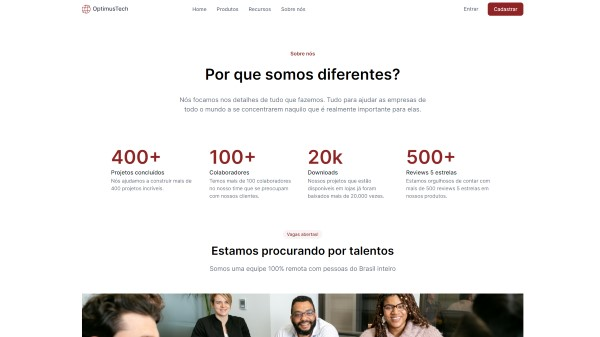

# **Alura OptimusTech**

<!-- PROJECT STATUS -->

> Project Status: ✅ (Concluded)

> [Live Code Preview](https://preedroos.github.io/alura-optimus-tech)

 

<!-- TABLE OF CONTENTS -->

  
Table of Contents

  <ol>
    <li>
      <a href="#about-the-project">About The Project</a>
      <ul>
        <li><a href="#built-with">Built With</a></li>
        <li><a href="#functionalities">Functionalities</a></li>
      </ul>
    </li>
    <li><a href="#contributing">Contributing</a></li>
    <li><a href="#contact">Contact</a></li>
  </ol>

 

<!-- ABOUT THE PROJECT -->

## **About The Project**

A Business Landing Page built along with 7 Days of Code challenge by Alura.

<!-- BUILT WITH -->

### **Built With**

This page was built using only `HTML` and `CSS`. The styling uses BEM (Block, Element, Modifier) methodology.

<!-- FUNCTIONALITIES -->

### **Functionalities**

The page is responsive to mobile and desktop.

[ <a href="#readme-top">back to top</a> ]

 

<!-- CONTRIBUTING -->

## **Contributing**

Contributions are what make the open source community such an amazing place to learn, inspire, and create. Any contributions you make are **greatly appreciated**.

If you have a suggestion that would make this better, please fork the repo and create a pull request. You can also simply open an issue with the tag "enhancement".
Don't forget to give the project a star! Thanks again!

1. Fork the Project
2. Create your Feature Branch (`git checkout -b feature/AmazingFeature`)
3. Commit your Changes (`git commit -m 'Add some AmazingFeature'`)
4. Push to the Branch (`git push origin feature/AmazingFeature`)
5. Open a Pull Request

[ <a href="#readme-top">back to top</a> ]

 

<!-- CONTACT -->

## **Contact**

Pedro Paulo Fagundes Cabral

- [GitHub](https://github.com/Preedroos)

- [LinkedIn](https://www.linkedin.com/in/pedropfcabral/)

- [Twitter](https://twitter.com/preedroos)

Email: preedroos@gmail.com

Project Link: [Alura OptimusTech](https://github.com/Preedros/alura-optimus-tech)

[ <a href="#readme-top">back to top</a> ]

